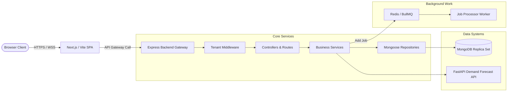
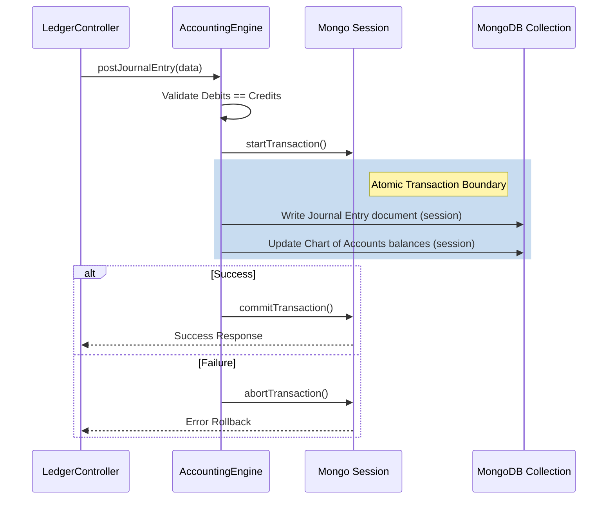

# Architectural Design Document - Amdox Enterprise ERP (MERN Stack)

This document provides a technical blueprint of the architecture and data patterns for the **Amdox Enterprise AI-Powered ERP Suite (AMX-ERP-2026-04)**.

---

## 1. System Overview

The system is constructed as a decoupled **MERN Single Page Application (SPA)** with a high-fidelity React frontend, an Express API gateway service, and a Python FastAPI demand forecasting service.

---

## 2. Multi-Tenancy Strategy (Discriminator-Based)

To provide multi-tenant SaaS features within a single MongoDB cluster, we implement a **Discriminator-Based Data Isolation** strategy.

### Rules & Mechanics
1.  **Strict Field Enforcement**: All collections (except system parameters) contain a required `tenantId` (ObjectId) field.
2.  **Context Injection**: The `tenantContext.middleware.ts` extracts the tenant ID from the decrypted JWT payload or the `X-Tenant-ID` header and mounts it directly onto `req.tenantId`.
3.  **Automatic Scoping**: Query helpers and schema wrappers dynamically inject `{ tenantId: req.tenantId }` into all database operations (`find`, `findOne`, `updateOne`, `deleteMany`). This guarantees that users from Company A can never access records from Company B.

---

## 3. Financial Transaction Integrity (Double-Entry Ledger)

MongoDB supports multi-document atomicity via **Sessions & ACID Transactions**. Because our General Ledger enforces strict double-entry validation, transactions are mandatory.

---

## 4. Background Job Architecture (BullMQ)

High-performance, long-running processes (like payroll distribution or emailing invoice batches) are dispatched asynchronously to offload work from the Express thread.

*   **Message Broker**: Redis 7.2 (Queue scheduling and event subscription).
*   **Worker Process**: Modular files matching specific tasks (e.g. `payrollJob.ts` executing gross-to-net math batches).
*   **Failures & Retries**: Jobs auto-retry up to 3 times with exponential backoff before being logged to the Dead Letter Queue.
